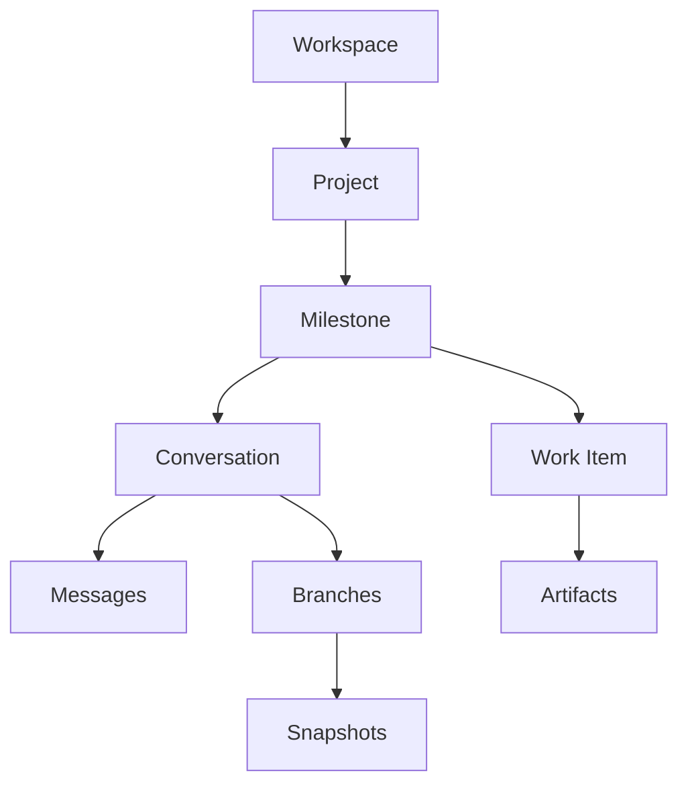
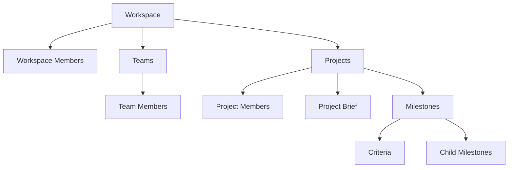
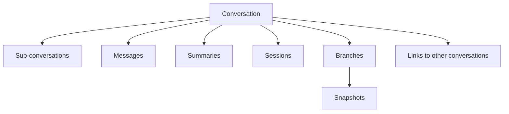
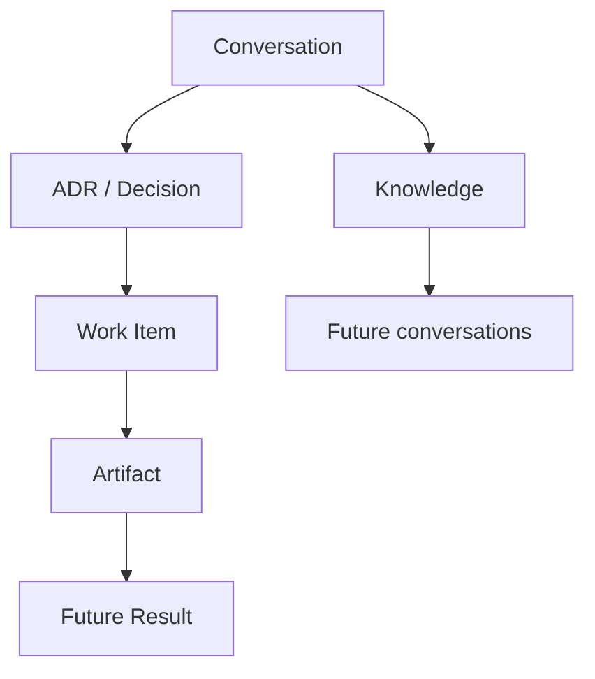
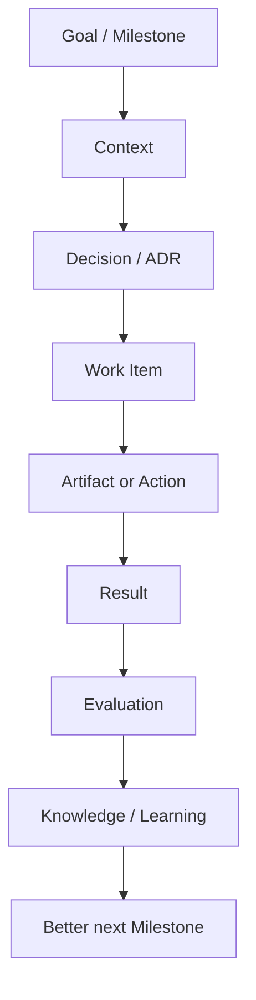
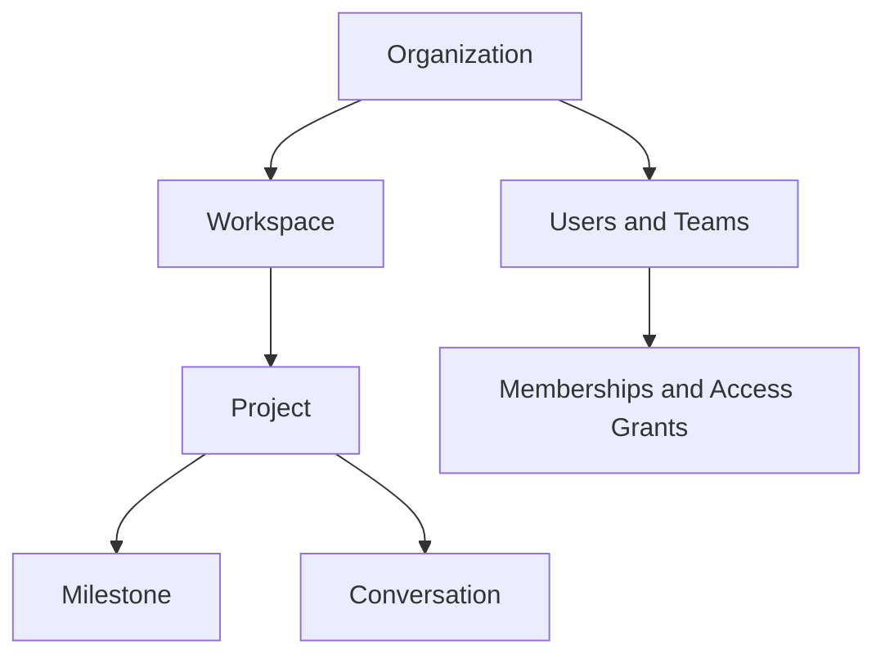

# Nexus Entity Model and Dataverse Relationships

Current and future-forward information model  
Baseline date: 17 August 2026

## Purpose

This document explains the main building blocks of NexusAI—Workspace, Project, Milestone, Conversation, Session, Branch, Snapshot, Knowledge, ADR, Work Item, Artifact and the supporting collaboration tables.

It also records:

- all 21 tables currently created in the `N_001_Nexus` Dataverse solution;
- what each table means in plain language;
- how the tables link to each other;
- which models currently exist in the C# solution;
- which tables still require application and API implementation;
- which additional tables will be needed for the future Nexus Result Loop and agent platform.

This is the canonical reference for deciding where new Nexus information belongs.

## Product ownership under V2.1

*Added under V2.1 — see ADR-011 in `08_DECISIONS_AND_TECHNICAL_DEBT.md` and
`NEXUS_ARCHITECTURE_V2.md` §1.3.*

**All 21 tables described in this document belong to the Chat product (`Nexus.Experience` /
`Nexus.Products.Chat.*`), not to a shared Nexus Platform.** Workspace, Project, Milestone,
Conversation, Knowledge, ADR, Work Item, Artifact, and every other concept below is
product-owned data. Nexus Platform (`Nexus.Platform`) holds no Workspace, Project, Conversation, or
Knowledge table and no product database at all — it is the backbone that Intelligence uses to
reach a model, not a shared foundation these tables sit on. A future product (Vault, ERP,
Nexus Build) gets its own store, its own schema, and will very likely **not** look like this
document at all.

**Memory is retired from this product's schema.** It no longer lives here, in any form —
present or future. Memory now belongs entirely to `Nexus.Intelligence.Memory` in the
`Nexus.Intelligence` solution, keyed by an opaque `ScopeRef` (kind, key, path) that this product
supplies but Intelligence never parses. There are no product foreign keys into Memory and
none are planned; see the note under "Code model without a confirmed Dataverse table" below,
and ADR-012.

### Forward note — Azure SQL migration (ADR-014)

ADR-014 (Azure SQL replaces Dataverse for the Chat product), written up in full in
`08_DECISIONS_AND_TECHNICAL_DEBT.md`, moves every table in this document from Dataverse to
Azure SQL. The `du_t_0nn_` naming below is retired as part of that migration: table names
lose both the `du_` publisher prefix and the `T_nnn_` sequence numbering that Dataverse
required — for example `du_t_001_workspace` becomes simply `Workspace`. The migration is a
schema rewrite, not a data migration (existing Dataverse contents are disposable smoke-test
records); it proceeds one aggregate at a time, Domain and Application untouched throughout —
see `ADR-014_AZURE_SQL_MIGRATION.md` §2 for the staged plan. Treat the logical names in this
document as historical once that migration executes, and update this file alongside it.

## Current source of truth

### Dataverse

The supplied Power Apps screenshot confirms:

- Environment: `PRT (Dev)`
- Solution: `N_001_Nexus`
- Custom tables created: **21**
- Publisher prefix: `du_`
- Physical logical names use lowercase, for example `du_t_001_workspace`

### C# solution

The supplied NexusAI ZIP currently contains domain and Dataverse infrastructure for:

- Workspace
- Project
- Conversation
- Conversation Message
- Session
- Branch
- Snapshot
- Knowledge
- ADR
- Work Item
- Artifact
- Memory *(as it existed before V2.1 — see below)*

Memory existed in the product's Domain and Infrastructure code but was never one of the 21
tables shown in the Dataverse screenshot. **Under V2.1 this mismatch is resolved by removal,
not by adding a table:** Memory is retired from the product entirely and now lives in
`Nexus.Intelligence.Memory`, keyed by `ScopeRef`. See "Product ownership under V2.1" above.

### Important distinction

**A table existing in Dataverse does not mean the feature is complete.**

A feature is complete only when it has:

`Dataverse table → Domain model → Mapper → Repository → Application handlers → API → Tests → Frontend`

## Nexus hierarchy at a glance



The simple user-facing hierarchy is:

**Workspace → Project → Milestone → Conversation or Work Item → Artifact**

Knowledge, ADRs, sessions, branches, summaries and access control support this hierarchy without making the main user experience complicated.

## Meaning of the main concepts

### Workspace

A Workspace is the highest working boundary visible to a user.

Examples:

- PRT Engine
- PRT Transport
- Personal
- Trips
- Nexus Development

A Workspace contains related teams, projects, conversations and knowledge. It also acts as an important security and context boundary.

A Workspace is not a company database by itself. In future, an Organization may own multiple Workspaces.

### Project

A Project is a defined outcome or long-running initiative inside one Workspace.

Examples:

- Vertical Boring Machine CNC Retrofit
- Nexus Workspace Frontend
- Sri Lanka Group Trip
- Engine Knowledge Centre

A Project contains its brief, milestones, conversations, work items, knowledge, decisions and artifacts.

### Project Brief

The Project Brief is the stable definition of the project.

It should explain:

- the problem;
- the desired outcome;
- scope and exclusions;
- constraints;
- stakeholders;
- success measures;
- current milestone;
- important assumptions.

There should normally be one active Project Brief per Project. Changes should be versioned or recorded in history rather than silently replacing the original intent.

### Project Milestone

A Milestone is a major stage or outcome inside a Project.

Milestones may contain child milestones through `ParentMilestone`. This creates the Git-like structure requested for Nexus:

```text
Main Milestone
  ├─ Step / Child Milestone
  │   ├─ Sub-step
  │   └─ Sub-step
  └─ Step / Child Milestone
```

Each Milestone can group conversations, work items and completion criteria. Reworking an approved milestone should create a new version or recorded change rather than erasing its history.

### Milestone Criterion

A Criterion is a measurable condition used to decide whether a Milestone is complete.

Examples:

- X-axis positioning error is within 0.05 mm.
- Workspace list loads from the real API.
- User can send a message and see it after refresh.

A Criterion is not a task. A task describes work to perform; a criterion describes proof that the outcome has been achieved.

### Conversation

A Conversation is a continuing discussion inside a Workspace and normally a Project.

It stores the identity and status of a chat, not all messages in one large text field.

A Conversation may have:

- a parent Conversation for a simple main-chat/sub-chat structure;
- many Messages;
- many Summaries;
- many Sessions;
- many Branches;
- many Snapshots;
- links to other Conversations;
- related Knowledge, ADRs, Work Items and Artifacts.

### Conversation Message

A Conversation Message is one individual turn in a Conversation.

It records the role, content, sequence and useful execution metadata such as model, token count, latency and prompt version where available.

Messages are the raw history. They are not the same as Knowledge, Memory, a Decision or a Summary.

### Conversation Summary

A Conversation Summary is a compressed representation of part or all of a Conversation.

It is used to:

- reduce context size;
- help a user resume quickly;
- retain the current problem, decisions and pending work;
- support context assembly without loading every Message.

Summaries must reference the Conversation and ideally the message range or point in time they cover.

### Conversation Link

A Conversation Link explicitly connects two Conversations.

Examples of link types:

- related to;
- continues;
- depends on;
- derived from;
- duplicates;
- replaces;
- blocks.

This is different from `ParentConversation`. ParentConversation builds a hierarchy; ConversationLink builds a graph between otherwise separate discussions.

### Session

A Session represents one active working period or execution period inside a Conversation.

For example, the same Conversation may be opened and worked on over five different days. It remains one Conversation but has five Sessions.

A Session stores:

- which Conversation it belongs to;
- when work started;
- when it ended;
- its status.

In future, a Session may also record the active user, agent, device, model, context version and usage totals.

### Branch

A Branch is an alternative line of exploration within a Conversation.

Examples:

- Main design
- Servo alternative
- Stepper alternative
- Low-cost approach

A Branch is not a separate Project. It allows alternatives to be explored without destroying the main direction. A Branch may later be merged, archived or accepted.

### Snapshot

A Snapshot captures the state of a Branch and Conversation at a particular moment.

It can preserve:

- selected context;
- plan state;
- draft content;
- configuration;
- milestone position;
- agent working state.

A Snapshot is not a summary. A Summary explains the discussion; a Snapshot preserves a restorable or inspectable state.

### Knowledge

Knowledge is trusted, reusable information that Nexus can apply beyond one message.

It can be scoped to:

- a Workspace;
- a Project;
- a source Conversation.

Examples:

- confirmed Dataverse naming rules;
- machine measurements;
- company policies;
- verified engine specifications;
- user-approved procedures.

Knowledge should include source, ownership, status, review date and expiry where appropriate.

### ADR

ADR means Architecture Decision Record. In Nexus, it should eventually support product and operational decisions in addition to software architecture.

An ADR records:

- the issue or context;
- alternatives considered;
- the accepted decision;
- reasons;
- consequences;
- status;
- the Conversation that produced it;
- an older ADR that it supersedes.

An ADR is an explicit approved decision. It is not an automatically generated chat summary.

### Work Item

A Work Item is an action that must be performed.

It may represent:

- a task;
- a bug;
- a feature;
- an investigation;
- an approval;
- a physical action.

It belongs to a Project and may link to a Milestone, Conversation and ADR. This connects discussion and decisions to execution.

### Artifact

An Artifact is a reusable output produced by work.

Examples:

- source code;
- document;
- spreadsheet;
- drawing;
- configuration;
- test report;
- generated image;
- machine program;
- deployment package.

An Artifact may link to the Project, Work Item, Conversation and ADR that created or approved it.

Artifacts should support versions. Large files should live in suitable file or blob storage while Dataverse keeps the identity, metadata, relationships and storage reference.

### Membership and access

WorkspaceMember, Team, TeamMember and ProjectMember define normal participation. AccessGrant handles exceptional or specific permissions.

Membership answers: **Who belongs here and in what role?**

AccessGrant answers: **Who has this specific permission on this specific resource, possibly until an expiry date?**

## All 21 Dataverse tables

All tables below are confirmed as created in the `N_001_Nexus` solution.

| No. | Display name | Dataverse logical name | Purpose | Current C# position |
|---|---|---|---|---|
| T_001 | Workspace | `du_t_001_workspace` | Top-level context, ownership and security boundary | Implemented |
| T_002 | WorkspaceMember | `du_t_002_workspacemember` | Connects users to Workspaces with roles/status | Dataverse created; code not found |
| T_003 | Team | `du_t_003_team` | Group of users inside a Workspace | Dataverse created; code not found |
| T_004 | TeamMember | `du_t_004_teammember` | Connects users to Teams | Dataverse created; code not found |
| T_005 | Project | `du_t_005_project` | Defined initiative inside a Workspace | Implemented |
| T_006 | ProjectMember | `du_t_006_projectmember` | Connects users to Projects with roles/status | Dataverse created; code not found |
| T_007 | ProjectBrief | `du_t_007_projectbrief` | Stable purpose, scope, constraints and success definition | Dataverse created; code not found |
| T_008 | ProjectMilestone | `du_t_008_projectmilestone` | Versionable project stages, steps and sub-steps | Dataverse created; code not found |
| T_009 | MilestoneCriterion | `du_t_009_milestonecriterion` | Measurable proof that a Milestone is complete | Dataverse created; code not found |
| T_010 | Conversation | `du_t_010_conversation` | Identity and status of a continuing discussion | Implemented |
| T_011 | ConversationMessage | `du_t_011_conversationmessage` | Individual human, AI, agent or system message | Implemented |
| T_012 | ConversationSummary | `du_t_012_conversationsummary` | Compressed conversation context | Dataverse created; code not found |
| T_013 | ConversationLink | `du_t_013_conversationlink` | Typed link between two Conversations | Dataverse created; code not found |
| T_014 | Session | `du_t_014_session` | One working/execution period in a Conversation | Implemented |
| T_015 | Branch | `du_t_015_branch` | Alternative path within a Conversation | Implemented |
| T_016 | Snapshot | `du_t_016_snapshot` | Captured state for a Conversation Branch | Implemented |
| T_017 | Knowledge | `du_t_017_knowledge` | Trusted reusable information | Implemented |
| T_018 | ADR | `du_t_018_adr` | Explicit decision and its reasoning/history | Domain and repository present; public API incomplete |
| T_019 | WorkItem | `du_t_019_workitem` | Executable project work | Implemented |
| T_020 | Artifact | `du_t_020_artifact` | Reusable output from work | Implemented |
| T_021 | AccessGrant | `du_t_021_accessgrant` | Resource-specific permission for a user or Team | Dataverse created; code not found |

“Implemented” means that the supplied ZIP contains the corresponding domain and Dataverse code. Frontend completion and comprehensive automated testing are separate requirements.

## Which tables have a C# aggregate

*Added under V2.1 — restates the "Current C# position" column above as a direct yes/no list,
and matches the High-priority debt item in `08_DECISIONS_AND_TECHNICAL_DEBT.md`.*

**Have a C# aggregate today** — Workspace, Project, Conversation, ConversationMessage,
Session, Branch, Snapshot, Knowledge, WorkItem, Artifact. ADR has a domain model and
repository but an incomplete public API.

**Exist as Dataverse tables but have no C# aggregate at all** — `ProjectBrief`,
`ProjectMilestone`, `MilestoneCriterion`, `Team`, `TeamMember`, `WorkspaceMember`, and
`ProjectMember`. (`ConversationSummary`, `ConversationLink`, and `AccessGrant` are also
unmodelled — see "Dataverse tables without corresponding code" below — but are lower
priority than the seven above.)

**Consequence:** because `ProjectBrief`, `ProjectMilestone`, and `MilestoneCriterion` have no
aggregate, the `Objective` `ContextItem` this product sends to Intelligence on every turn
currently carries only the project name, at `Authoritative` trust — not the brief, not the
active milestone, not its criteria. This is the single largest available answer-quality lever
in the product; see `NEXUS_ARCHITECTURE_V2.md` §3.1 for the `ContextItem` shape and
`08_DECISIONS_AND_TECHNICAL_DEBT.md` for the tracked debt item.

## Complete relationship registry

### Core lookup links

| Child table | Lookup field | Parent table | Relationship | Meaning |
|---|---|---|---|---|
| WorkspaceMember | Workspace | Workspace | N:1 | Membership belongs to one Workspace |
| Team | Workspace | Workspace | N:1 | Team belongs to one Workspace |
| TeamMember | Team | Team | N:1 | Membership belongs to one Team |
| Project | Workspace | Workspace | N:1 | Project belongs to one Workspace |
| Project | CurrentMilestone | ProjectMilestone | N:1 optional | Direct pointer to the active Milestone |
| ProjectMember | Project | Project | N:1 | Membership belongs to one Project |
| ProjectBrief | Project | Project | N:1 with one active brief | Brief defines one Project |
| ProjectBrief | CurrentMilestone | ProjectMilestone | N:1 optional | Brief identifies its current Milestone |
| ProjectMilestone | Project | Project | N:1 | Milestone belongs to one Project |
| ProjectMilestone | ParentMilestone | ProjectMilestone | N:1 optional self-link | Creates steps and sub-steps |
| MilestoneCriterion | Milestone | ProjectMilestone | N:1 | Criterion measures one Milestone |
| Conversation | Workspace | Workspace | N:1 | Conversation inherits Workspace scope |
| Conversation | Project | Project | N:1 | Conversation belongs to one Project |
| Conversation | ParentConversation | Conversation | N:1 optional self-link | Creates main/sub-conversation hierarchy |
| ConversationMessage | Conversation | Conversation | N:1 | Message belongs to one Conversation |
| ConversationSummary | Conversation | Conversation | N:1 | Summary describes one Conversation |
| ConversationLink | FromConversation | Conversation | N:1 | Starting side of typed link |
| ConversationLink | ToConversation | Conversation | N:1 | Destination side of typed link |
| Session | Conversation | Conversation | N:1 | Session occurred inside one Conversation |
| Branch | Conversation | Conversation | N:1 | Branch explores one Conversation |
| Snapshot | Conversation | Conversation | N:1 | Snapshot retains Conversation context |
| Snapshot | Branch | Branch | N:1 | Snapshot captures one Branch state |
| Knowledge | Workspace | Workspace | N:1 | Knowledge has a Workspace security/context scope |
| Knowledge | Project | Project | N:1 optional | Knowledge may be project-specific |
| Knowledge | SourceConversation | Conversation | N:1 optional | Records where Knowledge originated |
| ADR | Workspace | Workspace | N:1 | Decision has Workspace scope |
| ADR | Project | Project | N:1 optional | Decision may apply to one Project |
| ADR | SourceConversation | Conversation | N:1 optional | Records where the decision was discussed |
| ADR | SupersedesADR | ADR | N:1 optional self-link | Preserves decision replacement history |
| WorkItem | Project | Project | N:1 | Work belongs to one Project |
| WorkItem | Milestone | ProjectMilestone | N:1 optional | Work contributes to one Milestone |
| WorkItem | Conversation | Conversation | N:1 optional | Work originated from/is discussed in a Conversation |
| WorkItem | ADR | ADR | N:1 optional | Work implements an approved decision |
| Artifact | Project | Project | N:1 | Artifact belongs to a Project |
| Artifact | WorkItem | WorkItem | N:1 optional | Artifact is an output of Work |
| Artifact | Conversation | Conversation | N:1 optional | Artifact was produced/discussed in a Conversation |
| Artifact | ADR | ADR | N:1 optional | Artifact implements or records a decision |

### Membership links

Dataverse user references are shown here conceptually as `User`.

| Child | Link | Parent/principal | Meaning |
|---|---|---|---|
| WorkspaceMember | User | User | User participates in Workspace |
| TeamMember | User | User | User belongs to Team |
| ProjectMember | User | User | User participates directly in Project |
| AccessGrant | PrincipalId + PrincipalType | User or Team | Permission is granted to a User or Team |
| AccessGrant | ResourceId + ResourceType | Workspace, Project, Conversation, Knowledge or Artifact | Permission applies to a specific resource |

The current AccessGrant design uses generic GUID fields for Principal and Resource. This is flexible but Dataverse cannot enforce normal lookup integrity across multiple table types. A future implementation should either use Dataverse polymorphic/customer-style capabilities where appropriate or create typed nullable lookups with validation in the application layer.

## Relationship diagrams

### Organization and project structure



### Conversation structure



### From knowledge to execution



## Links seen by the user versus links maintained internally

The frontend should not show every database relationship at all times.

### User-visible primary navigation

`Workspace → Project → Milestone → Conversation / Work Item → Artifact`

### Context shown when relevant

- Knowledge used in the current Conversation
- ADR that authorized a Work Item
- Artifact produced by a Work Item
- Branch and Snapshot history
- Members and permissions
- Related Conversations

### Internally maintained links

- Workspace scope on Conversation, Knowledge and ADR
- source Conversation for Knowledge and ADR
- active/current Milestone pointer
- superseded ADR chain
- message sequence and summary coverage
- access grants
- future Result and Agent Run links

The system should create or suggest many of these internal links automatically. The user approves consequential changes such as accepting Knowledge, changing Milestones or accepting an ADR.

## How the model works in a real example

Example Project: **Vertical Boring Machine CNC Retrofit**

1. `Workspace`: PRT Engine.
2. `Project`: Vertical Boring Machine CNC Retrofit.
3. `ProjectBrief`: automate centering, boring movement and measurement safely.
4. `ProjectMilestone`: X-axis positioning system.
5. Child `ProjectMilestones`: motor selection, mechanical design, drive setup and accuracy test.
6. `MilestoneCriteria`: repeatability within the approved tolerance.
7. `Conversation`: choose NEMA 34 stepper versus servo.
8. `Messages`: individual questions, calculations and recommendations.
9. `Session`: the work performed on a specific day.
10. `Branch`: low-cost stepper design.
11. `Snapshot`: saved stepper configuration before testing.
12. `Knowledge`: confirmed motor and driver specifications.
13. `ADR`: use a particular motor/driver arrangement for the prototype.
14. `WorkItem`: fabricate the motor mounting plate.
15. `Artifact`: mounting drawing and parts list.
16. Future `Result`: measured repeatability after installation.

This chain allows Nexus to learn not only what was discussed, but what was decided, built and actually achieved.

## Current structural gaps

### Dataverse tables without corresponding code

The following tables exist in Dataverse but did not have matching Domain/Application/API implementations in the supplied ZIP:

- WorkspaceMember
- Team
- TeamMember
- ProjectMember
- ProjectBrief
- ProjectMilestone
- MilestoneCriterion
- ConversationSummary
- ConversationLink
- AccessGrant

These should be implemented as complete vertical slices when their user experience is needed. ProjectMilestone and MilestoneCriterion are the highest priority because the planned frontend depends on them.

### Code model without a confirmed Dataverse table

Memory existed in this product's Domain and Infrastructure code, but no Memory table ever
appeared in the 21-table screenshot. **Resolved under V2.1:** neither of the two options once
considered here (add a `T_022_Memory` table, or defer it) applies any more — Memory is
retired from the product's schema outright and rebuilt in `Nexus.Intelligence.Memory`, keyed
by `ScopeRef`. See "Product ownership under V2.1" near the top of this document.

Do not store Memory in Knowledge merely to avoid creating a table. They have different meanings and governance.

### Current code relationships are narrower than the future model

Examples:

- Current `Artifact` code requires WorkItem, while the future table model also links Artifact to Project, Conversation and ADR.
- Current `ADR` code is linked through Knowledge, while the future Dataverse design directly scopes ADR to Workspace, Project and source Conversation and supports `SupersedesADR`.
- Current `WorkItem` code directly contains Project only, while the future model adds Milestone, Conversation and ADR.
- Current `Conversation` code contains Workspace and Project but not ParentConversation.
- Current `Project` code does not contain CurrentMilestone.

The future model should guide the rework, but changes must be implemented and tested one vertical slice at a time.

## Future-forward extensions

The 21 current tables form the operational foundation, but the future Nexus vision requires additional first-class records.

The following numbers are recommendations, not existing Dataverse tables.

| Proposed no. | Future table | Purpose | Principal links |
|---|---|---|---|
| ~~T_022~~ | ~~Memory~~ | **Retired under V2.1** — not a product table, present or future. Lives in `Nexus.Intelligence.Memory`, keyed by `ScopeRef`, outside this product's Dataverse schema entirely. | — |
| T_023 | Result | Actual outcome of a recommendation, decision, Work Item or Artifact | Project, Milestone, Conversation, ADR, WorkItem, Artifact |
| T_024 | ResultMetric | Individual measurement used to evaluate a Result | Result; metric definition/unit |
| T_025 | AgentDefinition | Versioned identity, purpose, tools, permissions and evaluation rules of an Agent | Owner/Organization, Product |
| T_026 | AgentRun | One planned or executed Agent operation | AgentDefinition, Session, Conversation, WorkItem |
| T_027 | Approval | Human authorization for a decision, milestone change or action | Resource, approver, AgentRun/WorkItem |
| T_028 | Organization | Tenant/company/family boundary owning Workspaces | Users, Workspaces, subscriptions |
| T_029 | Product | Product identity such as Workspace, Vault, Trips or Business module | Organization, entitlements, Agents |
| T_030 | Connector | Governed external system connection | Organization, Product, AgentDefinition |
| T_031 | ActivityEvent | Append-only record of important system and user actions | Any governed resource |

Do not create all these tables immediately. Reserve the concepts and introduce each table only with a real vertical slice.

## Future Result Loop relationships



The future `Result` should be able to identify:

- intended outcome;
- actual outcome;
- success criteria;
- evidence;
- measurements;
- evaluator;
- responsible human or Agent;
- model, prompt, tool and version involved;
- related Decision, Work Item and Artifact;
- reusable learning.

Results are what transform Nexus from a structured chatbot into an intelligence system that improves from real-world outcomes.

## Ownership and tenant links required for public Nexus

Before Nexus becomes a public multi-user product, every durable record must resolve to an Organization/tenant.

Recommended ownership chain:



A Family in Vault may also be represented as an Organization-like tenant, with a different product experience and policy set.

## Relationship rules

1. Every Project belongs to exactly one Workspace.
2. Every Milestone belongs to exactly one Project.
3. Child Milestones use `ParentMilestone`; do not create separate step tables unless the behavior becomes materially different.
4. Every Conversation should belong to one Workspace and normally one Project.
5. Sub-conversations use `ParentConversation`; cross-topic associations use ConversationLink.
6. Every Message belongs to exactly one Conversation.
7. Every Session belongs to exactly one Conversation.
8. Every Branch belongs to exactly one Conversation.
9. Every Snapshot belongs to a Conversation and Branch.
10. Knowledge must have a clear scope and source.
11. An accepted ADR is never silently overwritten; a new ADR supersedes it.
12. Every Work Item belongs to a Project and should link to its Milestone when applicable.
13. Every Artifact must have an owning Project and a traceable origin.
14. Access is inherited through membership where possible; AccessGrant is used for explicit exceptions.
15. Archive and supersession are preferred to destructive deletion for decisions, knowledge, conversations and artifacts.
16. Important Actions must eventually be capable of linking to a Result.
17. Product databases must use Nexus APIs/events rather than directly changing Nexus Dataverse tables.

## Recommended implementation order

### Stage 1 — Complete the public Workspace product path

1. Verify Workspace, Project, Conversation, Message and Chat against the live tables.
2. Build the current frontend vertical slice.
3. Implement ProjectBrief.
4. Implement ProjectMilestone.
5. Implement MilestoneCriterion.
6. Link Conversation and WorkItem to Milestone.

### Stage 2 — Complete structured intelligence

1. Implement ConversationSummary.
2. Implement ConversationLink and ParentConversation.
3. Rework Knowledge lifecycle and source links.
4. Rework ADR to match the future direct relationship model.
5. ~~Resolve the Memory table decision.~~ Resolved under V2.1 — Memory moved to `Nexus.Intelligence.Memory`; no product-side action remains.

### Stage 3 — Complete collaboration and security

1. Implement Organization/tenant identity.
2. Implement WorkspaceMember.
3. Implement Team and TeamMember.
4. Implement ProjectMember.
5. Implement AccessGrant and inherited permission evaluation.

### Stage 4 — Build the differentiating Result Loop

1. Implement Result.
2. Implement ResultMetric and evidence.
3. Link Agent runs, decisions, Work Items and Artifacts to Results.
4. Feed evaluated learning back into Knowledge.
5. Use outcome history for agent and recommendation selection.

## Final model

The existing 21 Dataverse tables are a strong foundation. Together they represent four connected systems:

1. **Structure** — Workspace, Project, Brief, Milestone and Criterion.
2. **Conversation intelligence** — Conversation, Message, Summary, Link, Session, Branch and Snapshot.
3. **Execution and learning** — Knowledge, ADR, Work Item and Artifact.
4. **Collaboration and control** — WorkspaceMember, Team, TeamMember, ProjectMember and AccessGrant.

The future additions create the fifth system:

5. **Outcome intelligence** — Result, ResultMetric, AgentDefinition, AgentRun and Approval.
   (Memory is no longer part of this system — see "Product ownership under V2.1" above.)

These systems should remain linked through explicit IDs, stable APIs and governed history. That is how every future Nexus product—Workspace, Vault, Trips, Business, Build or Machines—can use the same intelligence foundation without becoming one monolithic application.
